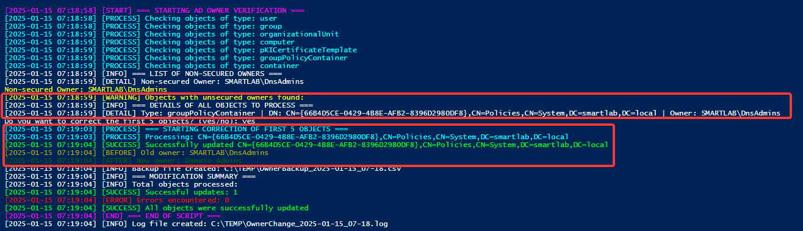

# Change SID OWNER

In an Active Directory environment, every object (user, group, computer, GPO, etc.) has an **owner**, identified by a **Security Identifier (SID)**. The owner's role is crucial, as it determines who has the necessary permissions to modify or delete the object. Invalid or missing owners can lead to **broken SIDs**, which have significant impacts on the security and stability of the infrastructure.


A **broken SID** refers to a SID that can no longer be resolved in Active Directory, typically because the corresponding user or group has been deleted.


### Why Assign Valid Owners Like **Domain Admins**?

#### 1. Preventing Broken SIDs

When a user or group is deleted, their SID becomes orphaned and cannot be resolved within Active Directory. This can cause access control issues and complicate object management. Assigning a stable group like **Domain Admins** ensures continuity and resilience in object ownership.

#### 2. Ensuring Centralized Security and Management

The **Domain Admins** group represents the most privileged administrators in the domain. Assigning this group as the owner ensures that only authorized and skilled personnel can modify or reassign permissions for critical objects.

#### 3. Reducing Operational Errors

An invalid owner can make modifying or managing an object impossible without complex, manual interventions. This slows down critical operations and may require additional scripts or tools to fix permissions.

#### 4. Aligning with Best Practices

Security audits strongly recommend maintaining valid and well-defined owners for all Active Directory objects. This reduces the risk of malicious exploitation and ensures strict governance of access rights.


Broken SIDs can create vulnerabilities that malicious actors can exploit, especially in environments where ownership and permissions are not strictly managed.


### Impact of Broken SIDs in Active Directory

* **Permission Issues**: Broken SIDs prevent the proper evaluation of access rights, disrupting applications or processes dependent on those objects.
* **Increased Security Risks**: Objects with invalid owners are potential targets for privilege escalation or abuse by malicious actors.
* **Management Complexity**: Identifying and fixing broken SIDs manually is time-consuming, particularly in large-scale environments.

### Key Recommendations

1. **Assign Stable Owners**: Always assign valid, non-deletable owners like the **Domain Admins** group to critical objects.
2. **Monitor Ownership**: Regularly review object ownership in Active Directory to detect and correct invalid or missing owners proactively.
3. **Automate Corrections**: Use scripts to identify and repair broken SIDs and invalid ownership efficiently. Ensure changes are documented to maintain transparency.


When using automation to fix invalid owners, always test scripts in a controlled environment to avoid unintended changes to production systems.


***


```powershell
Import-Module ActiveDirectory

$LogFile = "C:\TEMP\OwnerChange_$(Get-Date -Format 'yyyy-MM-dd_HH-mm').log"
$BackupFile = "C:\TEMP\OwnerBackup_$(Get-Date -Format 'yyyy-MM-dd_HH-mm').csv"

if (!(Test-Path "C:\TEMP")) {
    New-Item -ItemType Directory -Path "C:\TEMP" -Force
}

function Write-LogFile {
    param(
        [Parameter(Mandatory=$true)]
        [string]$Message,
        [string]$Type = "INFO"
    )

    $TimeStamp = Get-Date -Format 'yyyy-MM-dd HH:mm:ss'
    $LogEntry = "[$TimeStamp] [$Type] $Message"

    Add-Content -Path $LogFile -Value $LogEntry

    switch ($Type) {
        "ERROR"   { Write-Host $LogEntry -ForegroundColor Red }
        "WARNING" { Write-Host $LogEntry -ForegroundColor Yellow }
        "SUCCESS" { Write-Host $LogEntry -ForegroundColor Green }
        "PROCESS" { Write-Host $LogEntry -ForegroundColor Cyan }
        "START"   { Write-Host $LogEntry -ForegroundColor Magenta }
        "END"     { Write-Host $LogEntry -ForegroundColor Magenta }
        "BEFORE"  { Write-Host $LogEntry -ForegroundColor DarkYellow }
        "AFTER"   { Write-Host $LogEntry -ForegroundColor DarkGreen }
        default    { Write-Host $LogEntry -ForegroundColor White }
    }
}

$ObjectTypes = @(
    'user',
    'group',
    'organizationalUnit',
    'computer',
    'pKICertificateTemplate',
    'groupPolicyContainer',
    'container'
)

$SecuredOwners = @(
    "Administrators",
    "Domain Admins",
    "Enterprise Admins",
    "SYSTEM"
)

Write-LogFile "=== STARTING AD OWNER VERIFICATION ===" "START"

$UnsecuredObjects = foreach ($Type in $ObjectTypes) {
    Write-LogFile "Checking objects of type: $Type" "PROCESS"
    Get-ADObject -LdapFilter "(ObjectCategory=$Type)" -Properties nTSecurityDescriptor |
    Select-Object @{
        n="Type";
        e={$Type}
    }, @{
        n="DistinguishedName";
        e={$_.DistinguishedName}
    }, @{
        n="Owner";
        e={$_.nTSecurityDescriptor.Owner.Trim()}
    }, @{
        n="Secured";
        e={
            $owner = $_.nTSecurityDescriptor.Owner.Trim()
            $SecuredOwners | Where-Object { $owner -like "*$_*" } | ForEach-Object { return $true }
            $false
        }
    } |
    Where-Object { -not $_.Secured }
}

if ($UnsecuredObjects) {
    $UnsecuredObjects = $UnsecuredObjects | Select-Object -First 5

    $BackupData = @()
    $UniqueUnsecuredOwners = $UnsecuredObjects | Select-Object -ExpandProperty Owner -Unique | Sort-Object
    Write-LogFile "=== LIST OF NON-SECURED OWNERS ===" "INFO"
    foreach ($UnsecuredOwner in $UniqueUnsecuredOwners) {
        Write-LogFile "Non-secured Owner: $UnsecuredOwner" "DETAIL"
        Write-Host "Non-secured Owner: $UnsecuredOwner" -ForegroundColor Yellow
    }

    $TotalCount = $UnsecuredObjects.Count
    Write-LogFile "Objects with unsecured owners found: $TotalCount" "WARNING"

    Write-LogFile "=== DETAILS OF ALL OBJECTS TO PROCESS ===" "INFO"
    foreach ($Obj in $UnsecuredObjects) {
        Write-LogFile "Type: $($Obj.Type) | DN: $($Obj.DistinguishedName) | Owner: $($Obj.Owner)" "DETAIL"
    }

    $Response = Read-Host "Do you want to correct the first 5 objects? (yes/no)"

    if ($Response -eq 'yes') {
        Write-LogFile "=== STARTING CORRECTION OF FIRST 5 OBJECTS ===" "PROCESS"
        $SuccessCount = 0
        $ErrorCount = 0

        foreach ($Obj in $UnsecuredObjects) {
            try {
                Write-LogFile "Processing: $($Obj.DistinguishedName)" "PROCESS"

                # Backup old owner
                $OldOwner = $Obj.Owner
                $BackupData += [PSCustomObject]@{
                    DistinguishedName = $Obj.DistinguishedName
                    OldOwner = $OldOwner
                    NewOwner = "$env:USERDOMAIN\Domain Admins"
                }

                # Update owner
                $acl = Get-Acl "AD:$($Obj.DistinguishedName)"
                $acl.SetOwner([System.Security.Principal.NTAccount]"$env:USERDOMAIN\Domain Admins")
                Set-Acl -AclObject $acl -Path "AD:$($Obj.DistinguishedName)"

                Write-LogFile "Successfully updated $($Obj.DistinguishedName)" "SUCCESS"
                Write-LogFile "Old owner: $OldOwner" "BEFORE"
                Write-LogFile "New owner: Domain Admins" "AFTER"
                $SuccessCount++
            }
            catch {
                Write-LogFile "ERROR on $($Obj.DistinguishedName): $_" "ERROR"
                $ErrorCount++
            }
        }

        $BackupData | Export-Csv -Path $BackupFile -NoTypeInformation
        Write-LogFile "Backup file created: $BackupFile" "INFO"

        Write-LogFile "=== MODIFICATION SUMMARY ===" "INFO"
        Write-LogFile "Total objects processed: $TotalCount" "INFO"
        Write-LogFile "Successful updates: $SuccessCount" "SUCCESS"
        Write-LogFile "Errors encountered: $ErrorCount" "ERROR"

        $FinalCheck = $UnsecuredObjects.DistinguishedName | ForEach-Object {
            Get-ADObject -Identity $_ -Properties nTSecurityDescriptor |
            Where-Object {
                $owner = $_.nTSecurityDescriptor.Owner.Trim()
                -not ($SecuredOwners | Where-Object { $owner -like "*$_*" })
            }
        }

        if ($FinalCheck) {
            Write-LogFile "Warning: Some objects were not successfully updated" "ERROR"
            Write-LogFile "Number of objects not updated: $($FinalCheck.Count)" "ERROR"
        } else {
            Write-LogFile "All objects were successfully updated" "SUCCESS"
        }
    }
} else {
    Write-LogFile "No unsecured objects found" "SUCCESS"
}

Write-LogFile "=== END OF SCRIPT ===" "END"
Write-LogFile "Log file created: $LogFile" "INFO"
```


<figure><figcaption><p>Script Output</p></figcaption></figure>

<figure><figcaption><p>Backup Log</p></figcaption></figure>


Use this script responsibly. Incorrect changes to object ownership in Active Directory can have serious consequences if not tested properly.


Overview of the Script

The script performs the following key tasks:

* **Scans Active Directory Objects**: Identifies objects with invalid or unsecured owners.
* **Logs Detailed Actions**: Creates comprehensive logs for transparency and troubleshooting.
* **Corrects Ownership**: Updates invalid owners to a secure group (e.g., `Domain Admins`).
* **Creates Backups**: Saves a backup of current ownership information in CSV format.


Ensure that you execute this script in a **test environment** before applying it in production to avoid unintended changes.


***

### Configuration

#### 1. **Paths for Logs and Backups**

By default, the script saves logs and backup files in `C:\TEMP`. You can modify these paths by changing the following lines in the script:

```powershell
$LogFile = "C:\TEMP\OwnerChange_$(Get-Date -Format 'yyyy-MM-dd_HH-mm').log"
$BackupFile = "C:\TEMP\OwnerBackup_$(Get-Date -Format 'yyyy-MM-dd_HH-mm').csv"
```


The script will create the specified directory if it does not already exist.


***

#### 2. **Secure Owner Groups**

The script validates owners against the following default secure groups:

```powershell
$SecuredOwners = @(
    "Administrators",
    "Domain Admins",
    "Enterprise Admins",
    "SYSTEM"
)
```

If your organization uses additional secure groups, you can add them to this list.

***

### How It Works

#### 1. **Object Types Scanned**

The script scans the following object types in Active Directory:

* `user`
* `group`
* `organizationalUnit`
* `computer`
* `pKICertificateTemplate`
* `groupPolicyContainer`
* `container`

You can customize the object types by modifying this section of the script:

```powershell
$ObjectTypes = @(
    'user',
    'group',
    'organizationalUnit',
    'computer',
    'pKICertificateTemplate',
    'groupPolicyContainer',
    'container'
)
```

#### 2. **Identification of Unsecured Owners**

The script checks each object's owner against the `$SecuredOwners` list. Objects with invalid owners are flagged, and their details are logged.

#### 3. **Interactive Correction**

If unsecured objects are found:

1. The script displays the first 5 objects.
2. Prompts the user to confirm whether to correct their ownership (`yes/no`).
3. Updates the owner to **Domain Admins** for the selected objects.

#### 4. **Backup Creation**

Before making changes, the script saves a backup of each object's current owner in a CSV file. This allows rollback if needed.

***

### Example Usage

1.  **Run the Script** Execute the script in PowerShell with administrative privileges:

    ```powershell
    .\ADOwnerCorrection.ps1
    ```
2.  **Review Logs** Logs are saved at the specified path (`$LogFile`). A sample log entry:

    ```
    [2025-01-21 10:30:00] [PROCESS] Checking objects of type: user
    [2025-01-21 10:30:02] [WARNING] Objects with unsecured owners found: 3
    [2025-01-21 10:30:05] [SUCCESS] Successfully updated CN=John Doe,OU=Users,DC=example,DC=com
    ```
3. **Check Backup File** The backup CSV contains:
   * `DistinguishedName`: LDAP path of the object.
   * `OldOwner`: Original owner before modification.
   * `NewOwner`: New owner (e.g., `Domain Admins`).
