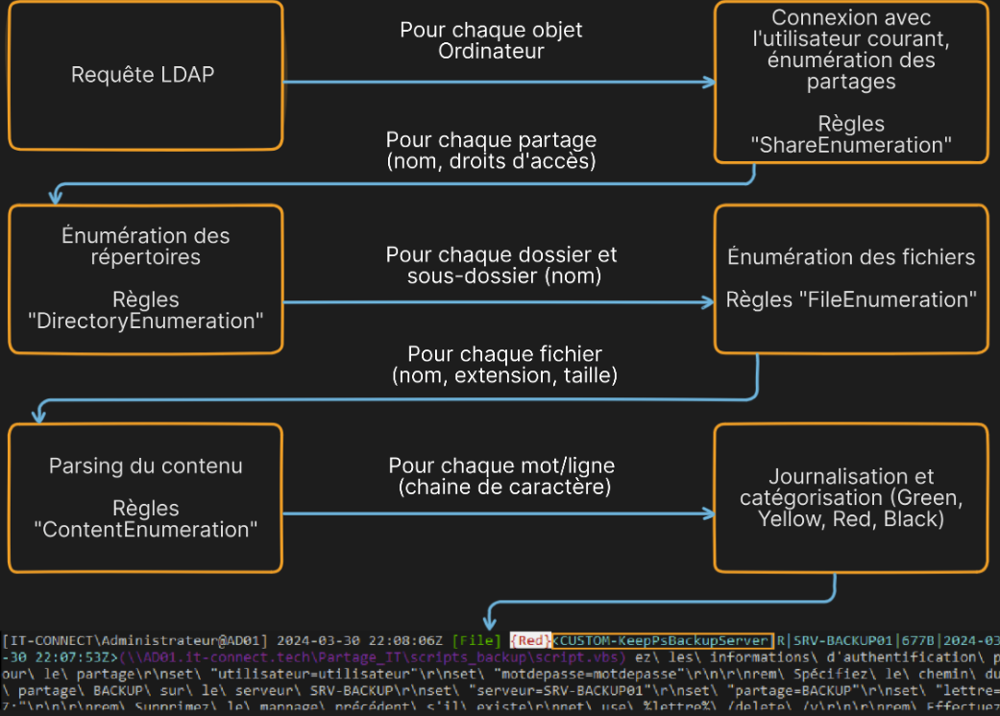

# Snaffler

Snaffler is a powerful tool designed for penetration testers, red teamers, and security professionals to search for sensitive information within file shares in an Active Directory environment. Its primary goal is to identify and extract valuable data such as:

* **Credentials** (passwords, hashes, tokens),
* **Configuration files**,
* **Private keys**,
* **Database connection strings**,
* Other sensitive information in shared resources.

It is an essential tool for both offensive security operations and internal audits to assess the security posture of file share permissions.

***

### How Snaffler Works

Snaffler uses directory enumeration and heuristic rules to locate sensitive data across shared file systems. The tool leverages **Active Directory share discovery** and filtering to optimize data gathering.

<figure><figcaption></figcaption></figure>

<figure><figcaption></figcaption></figure>

***

### Basic Command Syntax

```powershell
.\Snaffler.exe [options]
```

#### Commonly Used Options

**1. Verbosity Levels**

* `-v`: Defines the verbosity level of output.
  * **`Data`**: Shows only relevant data findings (recommended).
  * **`Debug`**: Includes debug information for troubleshooting.

**2. Logging Categories**

* `-b`: Filters results based on predefined sensitivity categories.
  * **`-b 3`**: Logs only the **Black** category (highest sensitivity).
  * **`-b 2`**: Logs starting from the **Red** category (recommended).

**3. Output Options**

* `-o [filename]`: Saves the results to a file (e.g., `snaffler.log`).

**4. Path or Share Targeting**

*   `-i`: Specifies paths or shares to scan. Example:

    ````powershell
    -i \AD01\Partage_IT
    -i C:  ```
    ````

**5. Share Discovery Without Host Scanning**

*   `-n`: Performs share discovery without scanning hosts. Example:

    ```plaintext
    -n AD01.it-tech,DESKTOP-VAU6BQO.it-tech
    ```

**Example Command:**

```powershell
.\Snaffler.exe -s -v Data -b 2 -o snaffler.log
```

***

### Advanced Usage

#### Targeted Scanning

* Use **`-i`** to focus on critical directories, such as:
  * Administrative shares (`C$`, `Admin$`),
  * Shared folders for finance, HR, or IT,
  * Backup directories.

Example:

```powershell
.\Snaffler.exe -i \Server01\Finance -v Data -b 2
```

#### Avoiding Detection

For stealthier operations during red teaming, consider:

1. Redirecting output to a file using `-o`.
2. Using low verbosity (`-v Data`) to minimize logging noise.

#### Prioritizing High-Risk Data

Start scans with **`-b 2`** to prioritize findings in the **Red** and **Black** categories, which typically include:

* Passwords,
* Configuration files with secrets,
* Private keys.

***

### Example Scenarios

#### Scenario 1: Searching for Password Files

```powershell
.\Snaffler.exe -i \Server01\Shared -v Data -b 2 -o results.log
rg -i "password" results.log
```

#### Scenario 2: Analyzing Sensitive Shares in AD

```powershell
.\Snaffler.exe -n AD01,Server02 -v Data -b 3 -o sensitive_shares.log
```

***
